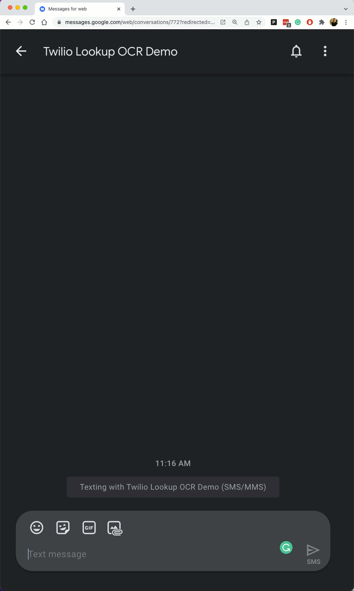

# Twilio Lookup Google Cloud Vision

This project allows anyone to use Twilio Lookup by texting / sending image of a phone number.


## Prerequisite

You will need the following:

- [Twilio Account](https://www.twilio.com/try-twilio)
- [Twilio CLI](https://www.twilio.com/docs/twilio-cli/quickstart)
- [Twilio CLI - Serverless Toolkit](https://www.twilio.com/docs/labs/serverless-toolkit)
- [Twilio Phone Number](https://console.twilio.com/us1/develop/phone-numbers/manage/search)
- [Google Vision API](https://cloud.google.com/vision/docs/ocr)
- [Service Account Key in JSON](https://cloud.google.com/docs/authentication/getting-started)

## Getting Started

1. git clone this project.

2. Navigate to the `/twilio/serverless`.

3. Put the Service Account Key in the asset folder and name the file as `google-creds.private.json`.

4. Execute the following commands:

```sh
npm install
```

```
twilio serverless:deploy
```

5. Copy the Domain. It should look like this **serverless-##-dev.twil.io**.

6. Go to [Twilio Studio](https://console.twilio.com/us1/develop/studio/flows)

7. Create a new Studio Flow and import the **Lookup-Driver.json**.

8. Click on the **InitalVariables** widget.

9. Add your Serverless Domain to the **ServerlessBaseURL** . It should look like this **https://serverless-##-dev.twil.io**.

10. Click Publish.

11. Copy the Studio Flow SID.

12. Add your Studio Flow SID and Phone Number to the **/twilio/serverless/.env-example**

13. Rename **.env-example** to be **.env**.

14. Reploy the code.

15. Go to your [Phone Number](https://console.twilio.com/us1/develop/phone-numbers/manage/active).

16. Under **Messaging** go to the `/driver` function.